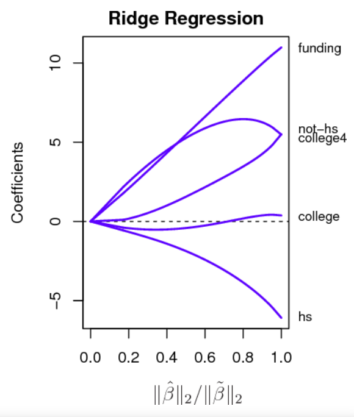

In machine learning, the name of the game is generalization. We want to
have a model perform well on the training set, but we need to make sure
that the patterns the model learns can actually generalize to data the
model hasn't seen before.

So, the scenario we want to avoid is that of **overfitting**. This
occurs when our model too strongly learns patterns in the training data,
and doesn't generalize well. Overfit models tend to exhibit large
generalization gaps: large differences in predictive performance between
the training and test data.

Overfitting can happen for a variety of reasons, the most well known of
which is having a model that's too complicated. Luckily, all is not
lost. There are a variety of approaches we can use to combat
overfitting. In general, these approaches are called **regularization**.

## Overfitting and Regularization

In the previous lesson, we discussed feature engineering, the process by
which we create new features in order to make our model more expressive.
One tradeoff to adding features to the model is that the model becomes
more complex, which makes it prone to overfitting.

For example, consider a basic regression with the points shown below:


We could fit a simple line to this data, which will exhibit some error.
However, we could also fit a more complex model - say, a polynomial -
which could perfectly fit to the training data. There will be no error
in the training predictions, which seems great!

But do we *really* think the polynomial is making good predictions on
*all* possible data points? Look at how it behaves in between the
training examples. It's very likely on *new* data - that is, when the
model needs to generalize - the linear model will perform much better
than the polynomial model. This is because the polynomial model overfit
to the data.

So, it's common in machine learning to follow a "parsimony principle".
Specifically, we aim to choose simpler models that can still be
predictive, because simpler models are less likely to overfit, and thus
generalize decently well.

Regularization is often thought of in terms of the **bias-variance
tradeoff**. Specifically, prediction errors often break down in terms of
two components: bias and variance. The linear model exhibits higher
bias, since it exhibits large errors on the training example. But the
polynomial model has higher variance - it's more likely to give wildly
different predictions for training samples close together.

We don't always have to use linear regression in the spirit of opting
for simpler models. Sometimes, it's good to use the complicated model,
particularly if it makes sense in a specific context. This is where
**regularization** is useful: a technique we can use to make a model
less prone to overfitting during training. It's important to note that
regularization is more of a concept than it is a specific, standardized
technique. There are many approaches used for regularizing. Today, we're
going to cover the usage of **penalty terms** to regularize linear
models.

------------------------------------------------------------------------

### Challenge 1: Warm-Up

Before we get started, let's warm up by importing our data and
performing a train test split. We've providing the importing code for
you. Go ahead and split the data into train/test sets using an 80/20
split, and a random state of 23.

Note: the variable penguins\$bill_length_mm has missing values. So we
don't run into errors later, before performing the 80/20 split drop any
rows that are missing for this variable.

```{r setup, include=FALSE}
suppressMessages(suppressWarnings({ 
  library(tidymodels)
  library(palmerpenguins)
  library(ggplot2)
}))
# Prefer tidymodels functions in any case of name conflict
tidymodels::tidymodels_prefer()
options(scipen = 999)
```

------------------------------------------------------------------------

## Regularization in Linear Regression

Linear regressions are surprisingly good at prediction compared to
alternative model specifications. Nonetheless, alternative fitting
procedures can yield better prediction accuracy and sometimes better
model interpretability.

If the true relationship between our dependent variable and features is
approximately linear, linear regression (fit with ordinary least squares
or OLS) will have low bias. In fact, given some assumptions about the
nature of the error term an OLS fit is the *best linear unbiased
estimator* possible. However, if our sample size is not much larger than
the number of features linear regression can have a lot of variability
in its fit, which leads to overfitting and poor predictions on the test
set. Furthermore, if the reverse is true and the number of features is
greater than the number of data points, linear regression does not have
a solution at all. The variance is infinite!

Regularizing or shrinking coefficients can substantially reduce the
variance of estimates, which leads to an improvement in accuracy for out
of sample prediction. There is no free lunch here, though. Recall the
bias-variance tradeoff: regularization and shrinking methods will
increase the bias of an estimate, but such bias is often negligible in
large samples.

Let's cover a common method for regularizing coefficients: *ridge
regression*.

### Ridge Regression

Recall the formulation of a linear model. We have the parameters we are
trying to estimate, given in the model:

$$Y = \beta_0 + \beta_1 X_1 + \ldots + \beta_P X_P$$

We do this by minimizing the following objective function:

$$
\begin{align}
\text{MSE} = L(\beta) &= \frac{1}{N}\sum_{i=1}^{N}(y_i - \hat{y}_i)^2 \\
&= \frac{1}{N}\sum_{i=1}^{N}\left(y_i - \beta_0 - \sum_{j=1}^P \beta_j X_j\right)^2
\end{align}
$$

We're going to regularize this model. We're not going to change the
actual linear model - that's the top equation - but we will change how
we choose the $\beta$ parameters. Specifically, we're going to do
**ridge regression** (also called $\ell_2$ regularization and Tikhonov
regularization). Instead of using the least squares objective function,
specified in the second equation, we're going to use the following
objective function:

$$ L(\beta) = \sum_{i=1}^N (y_i - \hat y_i)^2  + \alpha \sum_{j=1}^P \beta_j^2 $$

What's the difference? There's a second term added on, which is equal to
the sum of the squares of the $\beta$ values. What does this mean?

Our goal is for the loss, $L(\beta)$, to be as small as possible. The
first term says we can make that small if we make our errors,
$y_i - \hat y_i$, small. The second term says that we increase the loss
if the $\beta$ values get too large. There's a tradeoff here: if we make
the $\beta$ values all zero to accomodate the second term, then the
first term will be large. So, in ridge regression, we try and minimize
the errors, while trying hard not to make the coefficients too big.

Also, note that ridge regression requires a **hyperparameter**, called
$\alpha$ (sometimes $\lambda$). This hyperparameter indicates how much
regularization should be done. In other words, how much do we care about
the coefficient penalty term vs. how much do we care about the sum of
squared errors term? The higher the value of $\alpha$, the more
regularization, and the smaller the resulting coefficients will be. On
the other hand, if we use an $\alpha$ value of 0, we get the same
solution as the OLS regression done above.

Why does ridge regression serve as a good regularizer? The penalty
actually does several things, which are beneficial for our model:

1.  **Multicollinearity:** Ridge regression was devised largely to
    combat multicollinearity, or when features are highly correlated
    with each other. Ordinary least squares struggles in these
    scenarios, because multicollinearity can cause a huge increase in
    variance: it makes the parameter estimates unstable. Adding the
    penalty term stabilizes the parameter estimates, at a little cost to
    bias. This results in better generalization performance.
2.  **Low Number of Samples:** The most common scenario where you might
    overfit is when you have many features, but not many samples. Adding
    the penalty term stabilizes the model in these scenarios. There's
    not a great intuition for this without diving into the math, so you
    can just take it at face value.
3.  **Shrinkage:** The $\ell_2$ penalty results in shrinkage, or a small
    reduction in the size of the parameters. This is effectively a bias,
    but helps regularize by reducing variance that often comes with
    overfit models.

Let's start with a linear regression baseline. We're only going to use
numerical predictors, this time:

```{r create_model}
linear_model <- linear_reg(
  mixture = 0, # This specifies only ridge regression
  penalty = 0, # This specifies the penalty to apply - no penalty for now
  engine = "lm")
```

```{r}
# Use penguins recipe from last lesson
penguins_recipe <- 
  recipe(bill_length_mm ~ bill_depth_mm + flipper_length_mm + body_mass_g,
         data = penguins_train) %>%
  step_impute_median(all_numeric_predictors()) %>%
  step_normalize(all_numeric_predictors())
```

```{r}
linear_wflow <- workflow() %>%
  add_recipe(penguins_recipe) %>%
  add_model(linear_model)
# Run fit
penguins_linear_fit <- fit(linear_wflow, penguins_train)
# View model
penguins_linear_fit %>% tidy()
```

OK, now let's fit a ridge model. Let's apply a huge penalty, just to see
what happens:

```{r ridge_model}
ridge_model <- linear_reg(
  mixture = 0, # This specifies only ridge regression
  penalty = 10000, # Apply a large penalty
  engine = "glmnet") # We're using a different engine
```

Notice that, in the `tidymodels` framework, it's pretty easy to swap out
new models in a workflow:

```{r}
ridge_wflow <- workflow() %>%
  add_recipe(penguins_recipe) %>%
  add_model(ridge_model)
# Run fit
penguins_ridge_fit <- fit(ridge_wflow, penguins_train)
# View model
penguins_ridge_fit %>% tidy()
```

What do you notice about the new coefficients? The takeaway here is that
larger penalties will result in smaller coefficients. As the penalty
increases, the impacts on coefficients will look different. Consider the
following example, taken from "Statistical Learning with Sparsity" by
Hastie et al. The setting here is a regression using several variables,
indicated on the right. As the penalty decreases (right to left), the
coefficient values decrease as well. However, there are some interesting
patterns: consider the `not-hs` variable, for example.

{width="442"}

------------------------------------------------------------------------

### Challenge 2: Trying out New Values

Try performing the following experiments. What do you notice about the
coefficients?

1.  Try a much smaller value for the penalty, such as 1, or 0.1. How do
    the coefficients look?
2.  Replace mixture with the value 1, and try a very large value. This
    is known as the lasso, which is a different way to regularize
    coefficients in a linear model. What do you notice?

------------------------------------------------------------------------

## Choosing Hyperparameters: Validation Sets

It's nice that we can do different types of regularization, but how do
we know what value of the mixture coefficient to pick? In machine
learning, this value - which we choose before fitting the model - is
known as a hyperparameter. Since hyperparameters are chosen *before* we
fit the model, we can't just choose them based off the training data.
So, how should we go about conducting **hyperparameter tuning**:
identifying the best hyperparameter(s) to use?

Let's think back to our original goal. We want a model that generalizes
to unseen data. So, ideally, the choice of the hyperparameter should be
such that the performance on unseen data is the best. We can't use the
test set for this, but what if we had another set of held-out data?

This is the basis for a **validation set**. If we had extra held-out
dataset, we could try a bunch of hyperparameters on the training set,
and see which one results in a model that performs the best on the
validation set. We then would choose that hyperparameter, and use it to
refit the model on both the training data and validation data. We could
then, finally, evaluate on the test set.


So, you'll often see a dataset not only split up into training/test
sets, but training/validation/test sets, particularly when you need to
choose a hyperparameter.

### Cross-Validation

We just formulated the process of choosing a hyperparameter with a
single validation set. However, there are many ways to perform
validation. The most common way is **cross-validation**.
Cross-validation is motivated by the concern that we may not choose the
best hyperparameter if we're only validating on a small fraction of the
data. If the validation sample, just by chance, contains specific data
samples, we may bias our model in favor of those samples, and limit its
generalizability.

So, during cross-validation, we effectively validate on the *entire*
training set, by breaking it up into folds. Here's the process:

1.  Perform a train/test split, as you normally would.
2.  Choose a number of folds - the most common is $K=5$ - and split up
    your training data into those equally sized "folds".
3.  For *each* hyperparameter, we're going to fit $K$ models. Let's
    assume $K=5$. The first model will be fit on Folds 2-5, and
    validated on Fold 1. The second model will be fit on Folds 1, 3-5,
    and validated on Fold 2. This process continues for all 5 splits.
4.  Each hyperparameter's performance is summarized by the average
    predictive performance on all 5 held-out folds. We then choose the
    hyperparameter value that had the best average performance.
5.  We can then refit a new model to the entire training set, using our
    chosen hyperparameter(s). That's our final model - evaluate it on
    the test set!


## Hyperparameter Tuning and Cross Validation in Practice

So, we need to do two things:

1.  Decide to perform hyperparameter tuning on the penalty value, and
2.  Do so using cross-validation.

The `tidymodels` suite has two packages to help us with these steps:
`tune` and `rsample`.

Let's illustrate both these packages in the ridge regression example. We
already have a recipe set up:

```{r}
penguins_recipe %>% tidy()
```

When specifying the ridge model, however, we're going to do something
slightly different:

```{r}
tuned_ridge_model <- linear_reg(
  mixture = 0,
  penalty = tune(),
  engine = "glmnet")
```

We passed in a function called `tune()`. This signals to `tidymodels`
that we'd like to tune this hyperparameter. How do we indicate what
values we should test during tuning? There is a package called `dials`
which allows a variety of ways to customize this. We're going to keep
things simple and focus on the most basic choice of tuning: a grid
search. In this case, we specify a range of values, and we'll test every
single one for the hyperparameter. We use the `grid_regular` function
for this procedure:

```{r}
# Create grid of parameters
penalty_grid <- grid_regular(
  # The penalty function is a special dials function
  penalty(range = c(-5, 5)),
  # We want 50 values
  levels = 50)
print(penalty_grid)
```

Next, we need to specify how we will perform cross-validation. From the
`rsample` package, we can use the function `vfold_cv` to create the
training folds. In this case, `v` is what's used for "K".

```{r}
penguin_folds <- vfold_cv(penguins_train, v = 5)
penguin_folds
```

We have a tuned model, a grid of hyperparameters, and a set of folds. We
create our workflow as before. But, to train the workflow, we use the
`tune_grid` function. All the pieces we've created are passed into this
function:

```{r}
# Create workflow
ridge_wflow <- workflow() %>%
  add_recipe(penguins_recipe) %>%
  add_model(tuned_ridge_model)

# Tune and fit models with tune_grid()
ridge_fit <- tune_grid(
  # The workflow
  ridge_wflow, 
  # The folds we created
  resamples = penguin_folds,
  # The grid of hyperparameters
  grid = penalty_grid)
```

There are some nice plotting functions we can use to visualize how the
performance varies as a function of the regularization. For example,
check out the autoplot function:

```{r}
autoplot(ridge_fit)
```

What does this tell us about how much regularization we should use?

Of course, we can automate this procedure. The `select_best` function
will do this for us:

```{r}
# Select best metric according to rsq
ridge_best <- select_best(ridge_fit, metric = "rsq")
ridge_best
```

We can see a penalty column, where it appears to have chosen the
smallest penalty. What do we do at this point?

Recall that, during cross-validation, we split up the data and examine
performance across many folds. Now that we know what is likely the best
penalty, we can re-train on the *entire* training set.

We do this with the `finalize_workflow` function.

```{r}
# Get our final model and finalize workflow
ridge_final <- ridge_wflow %>%
  finalize_workflow(parameters = ridge_best) %>%
  fit(data = penguins_train)
ridge_final %>% tidy()
```

And lastly, we'll examine the performance on the test set:

```{r}
augment(ridge_final, new_data = penguins_test) %>%
  rsq_trad(truth = bill_length_mm, estimate = .pred) 

```

If we compare this to the model we fit earlier where we made a guess at
the best value for the penalty hyperparameter, it reveals that we that
we can fit better models via cross-validation than with just a single
training set. This is reflected by the higher $R^2$ averages.

```{r}
# compare to the model we fit in challenge 2 where penalty was chosen at random
augment(penguins_ridge_fit, new_data = penguins_test) %>%
  rsq_trad(truth = bill_length_mm, estimate = .pred)
```
